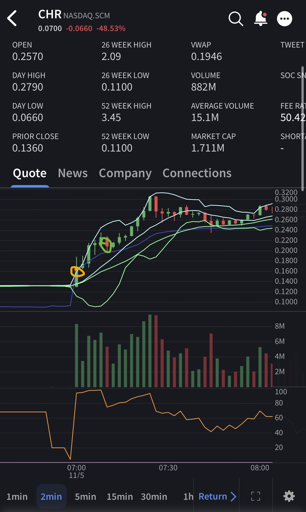

# Trade #2 - CHR

## Trade Details

- **Ticker**: CHR
- **Direction**: LONG
- **Entry**: $0.1714 on 2025-11-05 at 07:03
- **Exit**: $0.2204 on 2025-11-05 at 07:09
- **Position Size**: 300 shares
- **Strategy**: Breakout
- **Broker**: IBKR

## Risk Management

- **Stop Loss**: $.165
- **Target Price**: $0.25
- **Risk:Reward Ratio**: 1:12.28

## Results

- **P&L (USD)**: $14.70
- **P&L (%)**: 28.59%

## Notes

Entered on first candle after 7am, a new strategy I am trying out. Rode to first red, could have held longer, will be watching closer next time.

## Screenshots

