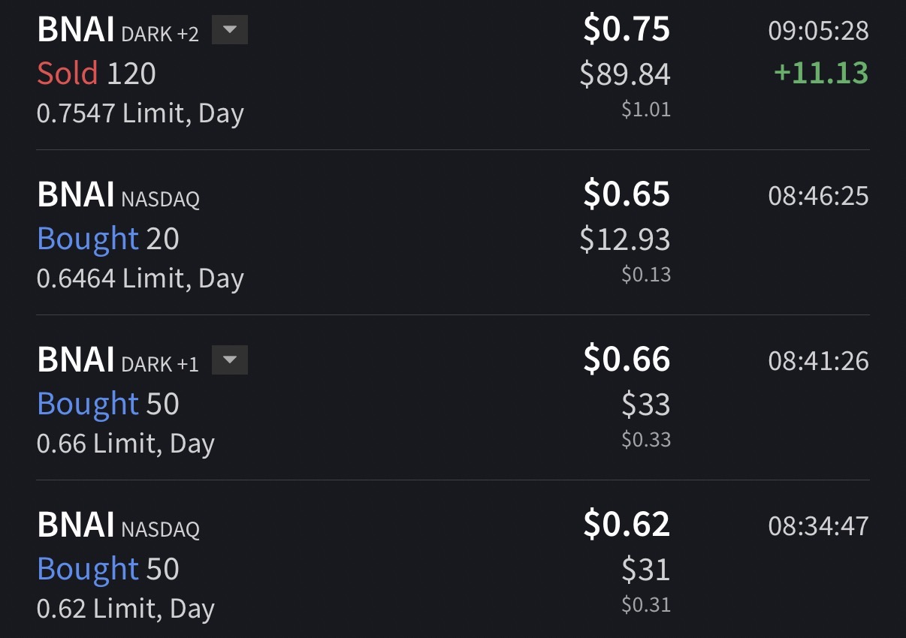

# Trade #1 - BNAI

## Trade Details

- **Ticker**: BNAI
- **Direction**: LONG
- **Entry**: $0.6475 on 2025-11-10 at 08:35
- **Exit**: $0.7514 on 2025-11-10 at 09:05
- **Position Size**: 120 shares
- **Strategy**: VWAP Hold
- **Broker**: IBKR

## Risk Management

- **Stop Loss**: $0.60
- **Target Price**: $0.75
- **Risk:Reward Ratio**: 1:2.16

## Results

- **P&L (USD)**: $12.47
- **P&L (%)**: 16.05%

## Notes

It was on the morning scanner with a decent bit of short-able shares, spiked twice pre-market, and was climbing back to H.O.D with shorts still trying to push down, and so I entered in anticipation of a short term spike from the volatility and sold at ~100% on the day(I took ~13% after fees). Waiting for the setups to come to me.

## Screenshots

